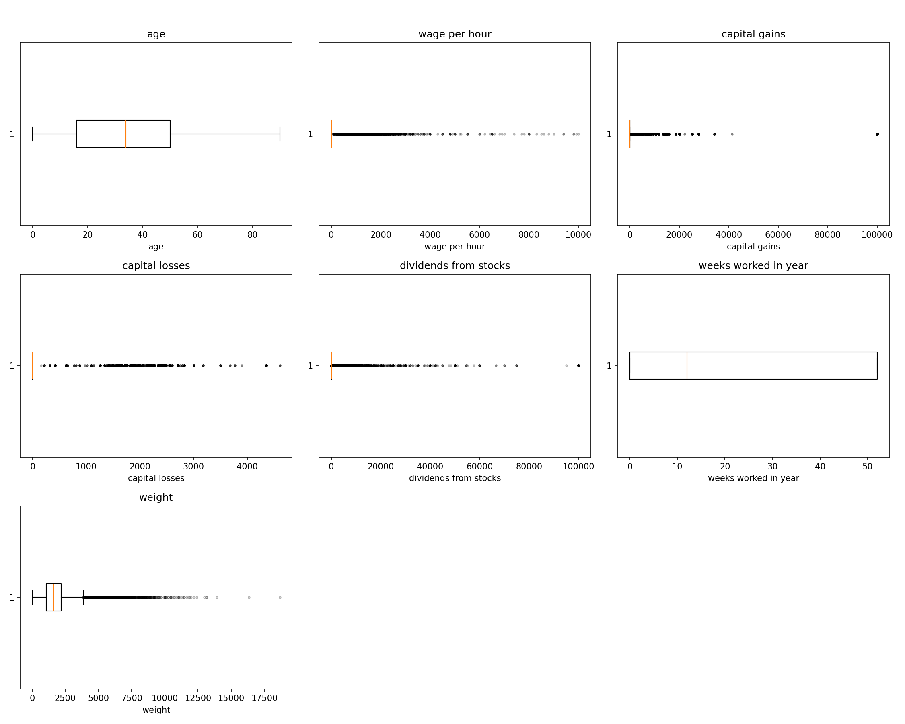
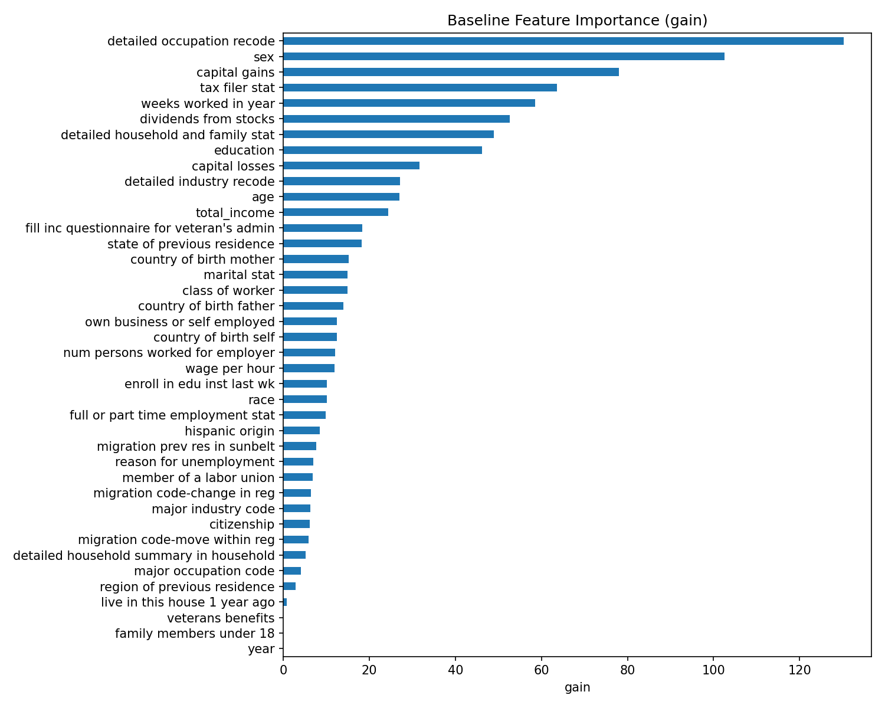
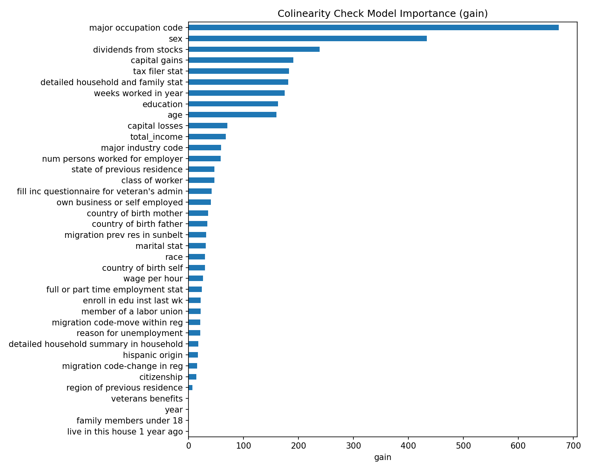
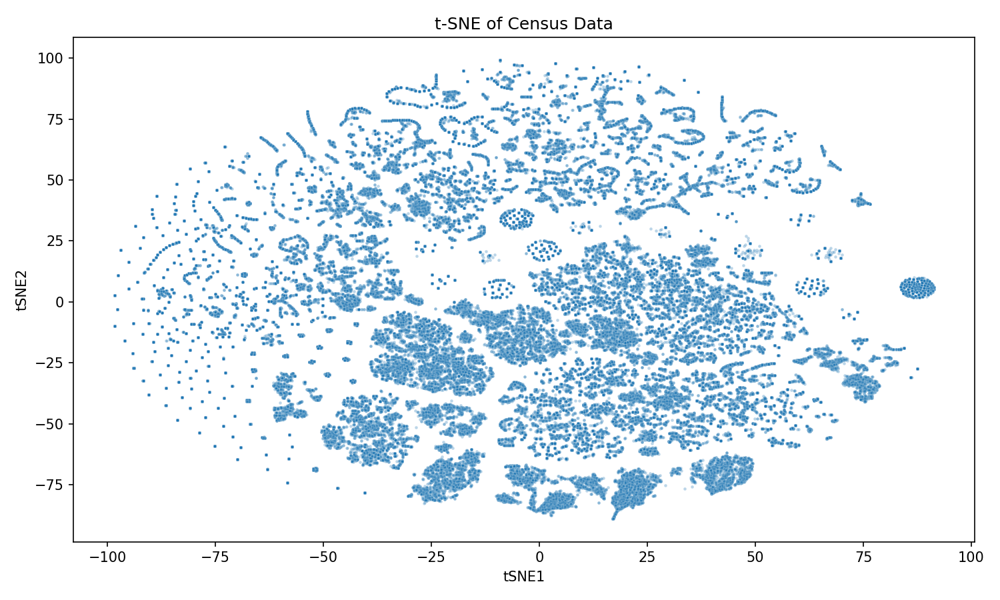
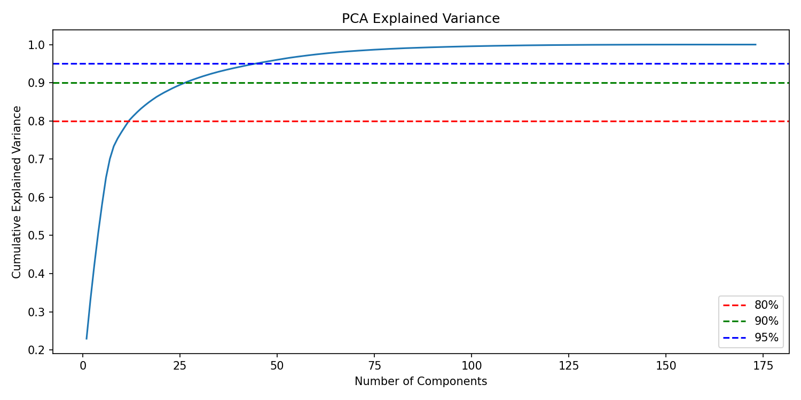
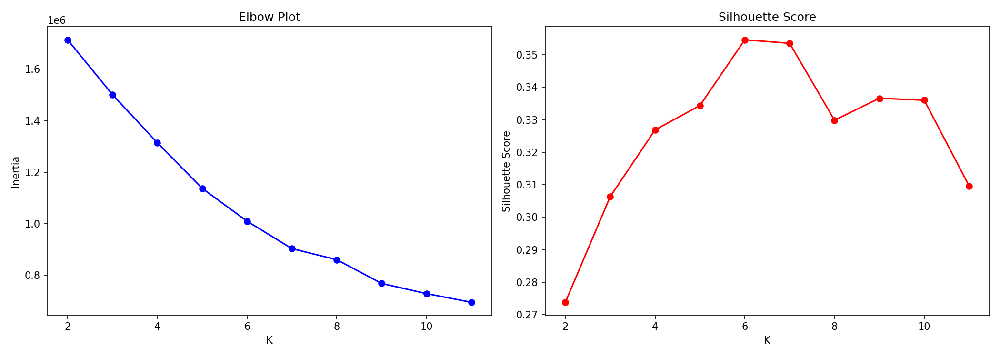
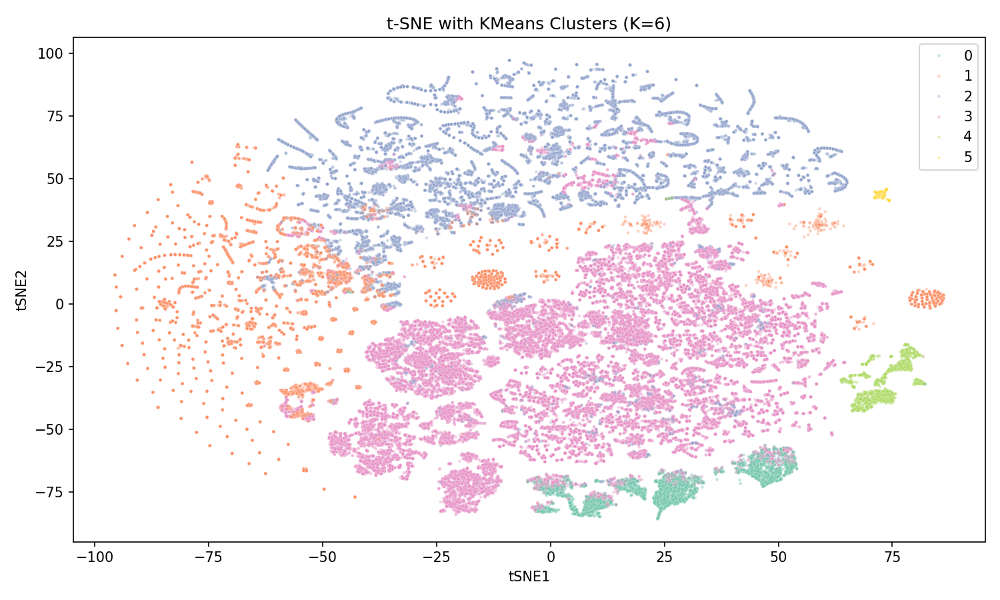
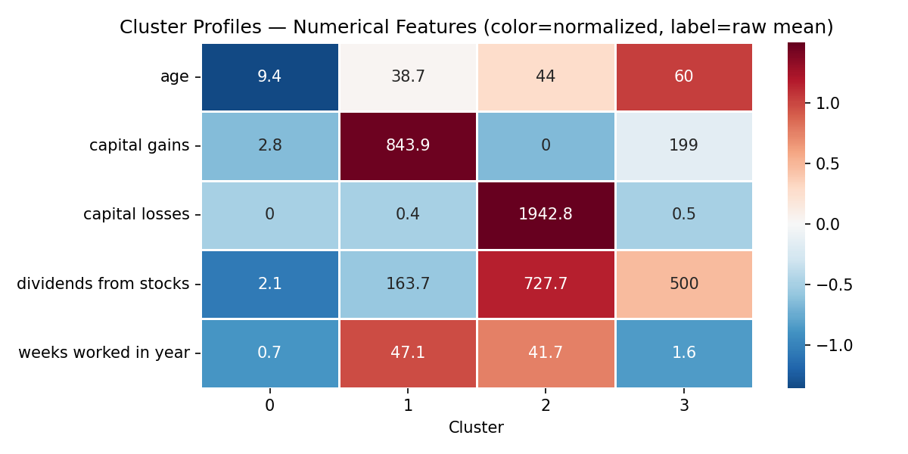
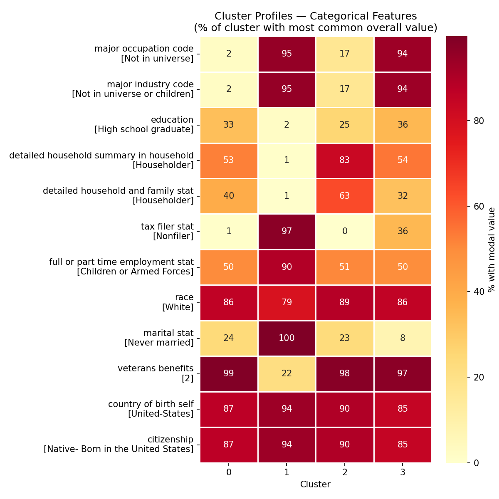

# Income Prediction (-50K vs 50K+) 

## Data Exploration and Analysis
- The nature of the problem is a binary classification problem where we are trying to predict whether an individual's income exceeds $50K per year based on various features such as age, education, occupation, etc.
- The dataset contains a mix of numerical and categorical features. Some of the key features include:
    - Age: A numerical feature representing the age of the individual.
    - Sex: A categorical feature indicating the gender (M/F).
    - Education: A categorical feature representing the highest level of education attained.
    - Capital gains and losses: Numerical features representing the capital gains and losses of the individual. With Capital Gains capped at 99k
    - Wage per hour: A numerical feature representing the wage per hour, capped at 9.9k.
    - Dividends from stocks: A numerical feature representing the dividends received from stocks.
    - Weeks worked in year: An ordinal feature representing the number of weeks worked in a year.
    - Detailed household and family stat: A categorical feature. 
    - tax filer stat: A categorical feature representing the tax filing status of the individual.
    - Major Industry code, detailed industry recode: Categorical features representing the industry in which the individual works.
    - Detailed occupation recode: A categorical feature representing the occupation of the individual.
- Labels: - 50000. and 50000+, referred in the document as -50K and 50K+ and 0 and 1 respectively.
- One of the first things to notice is the heavy class imbalance in the target variable, with a ratio of 15:1 between -50K:50K+.
- Another crucial observation is that the data is well populated with very few missing values, and '?' which probably represents an answer that was not able to be deciphered during data collection. We denote these as missing values. 
- Not in universe is a term used in the dataset to indicate that a particular feature is not applicable to an individual.
- The columns with a large number of Not in universe values which still provide information for prediction are:
    - 'major industry code'
    - 'major occupation code'
    -  We look into this deeply in the following sections. 

## Data Cleaning and Preprocessing
- The labels - 50000. and 50000+. were converted to 0 and 1 respectively for easier modeling.
- The missing values represented by '?', 'Not identifiable' and np.nan were replaced with na. 
- We removed the column with more than 50% missing values which was 'migration code-change in msa'.
- The missing values in the remaining columns were a small percentage of the total values and were handled better by our model rather than being imputed, so we left them as is.
- 'Detailed Occupation recode' and 'Detailed Industry recode' were converted from numerical to categorical features and converted to string type. This is to prevent the model from treating them as ordinal features and to allow it to capture the categorical nature of these features.

## Numerical Features
- After our data cleaning and preprocessing steps, we had 6 numerical features: age, capital gains, capital losses, wage per hour, dividends from stocks, and weight. 
- Reminder that the wage per hour and capital gains and dividends from stocks were capped at 9.9k and 99k and 99k respectively. A precaution taken by the census to prevent identification of high income individuals.  
- Weight is a feature that represents the number of people in the population that each row in the dataset represents. It is used to account for the sampling design of the dataset and to ensure that the model's predictions are representative of the overall population.
- We also created a new feature called total income which is the annualised wage of the individual.
    - We annualised the wage by multiplying the wage per hour by 35 which is defined by the Census as the classification for a full-time worker. We then multiply that number by 52. On account of if the individual is a part-time worker, we divide the annualised wage by 2. We find that information in the 'full or part time employment stat' column.
    - An avid reader would question why we have not included capital gains and dividends from stocks in the total income feature. They would also question why is prediction of income is even a problem given that we can roughly calculate the individual's total income. 
        - The issue with the latter is that in the minority class (50K+), those who have responded to have worked 52 weeks in a year, have not necessarily responded to have a high wage per hour. In fact, most of those individuals actually have a wage per hour of 0. 
        - The issue with the former is largely because capital gains itself is a very strong and a rather sparse indicator. Including it in the total income feature did not provide much of a boost to the model performance and it also made the feature less interpretable.

- Distribution of numerical features:

## Categorical Features
- Categorical features are the rest of the 35 features in the dataset.
- Majority of these features are nominal categorical features. 
- This makes the 'decision' to use a 'decision tree-based' model easier because of the models ability to split on criterion. This allows for us to also have a non-linear decision boundary which is important given the complexity of the problem.
- There are features with cardinality of 2 for Sex, year and as high as 52 for detailed industry recode and 47 for detailed occupation recode.
- Largely the data distribution of the categorical features is skewed with a majority of the data points belonging to a few categories. When the priority is interpretability, we can consider grouping the categories with low frequency into an 'other' category. 
    - An example of this is are categories such as country of birth, hispanic origin, country of birth father, country of birth mother which have a large number of categories with a long tail distribution. 
    - These high-dimensional categorical features add to the reason to swing towards a decision tree-based model as opposed to a linear model which would require one-hot encoding and would not be able to capture the relationships between the categories as effectively.

## Model Selection and Training
- We chose to use XGBoost as our model for this problem due to its ability to handle both numerical and categorical features, its robustness to missing values, and its strong performance on classification tasks.
- We used Optuna for hyperparameter tuning to find the best parameters for our XGBoost. Optuna allows us to efficiently search through the hyperparameter space and provide a range of values instead of a specific set of values, which can lead to better exploration and potentially better performance.
- XGBoost uses a boosting algorithm that builds an ensemble of weak learners (decision trees) to create a strong predictive model.
- It uses L2 regularization in its object function to prevent overfitting. 
- It works by creating estimators sequentially, where each new estimator focuses on correcting the errors made by the previous ones. The final prediction is a weighted sum of the predictions from all the estimators. 
- The hyperparameters we tuned were:
    - max_depth: The maximum depth of the trees. A deeper tree can capture more complex patterns but can also lead to overfitting.
        - Range: 6 to 10
    - max_leaves: The maximum number of leaves in a tree. This can help control the complexity of the model and prevent overfitting.
        - Range: 20 to 40
    - n_estimators: The number of trees in the ensemble. More trees can improve performance but also increase training time.
        - Range: 100 to 500
- We focus on these hyperparameters due to their impact on performance and their ability to control overfitting.
- For hyperparameter tuning we used 3-fold cross-validation and for final model eval we use 5-fold for the final model evaluation. The cross validation is to better approximate the model's performance on unseen data, i.e. generalizability. 

- 3-fold for tuning reduces compute cost across 30 Optuna trials, while 5-fold for the final model gives a more reliable performance estimate when compute is less of a concern.

- The loss function used is the binary logistic loss function
    - $ L(y, \hat{y}) = -\frac{1}{N} \sum_{i=1}^{N} [y_i \log(\hat{y}_i) + (1 - y_i) \log(1 - \hat{y}_i)] $
    - Where $y_i$ is the true label and $\hat{y}_i$ is the predicted probability for the positive class.

## Evaluation
- We used macro F1 score which is calculated as follows:
    - F1 Score for each class = $ \frac{2 \times (\text{Precision} \times \text{Recall})}{\text{Precision} + \text{Recall}} $
    - Macro F1 Score = $ \frac{\sum_{i=1}^{c} F1_i}{c} $

## Feature Importance and Selection
- Once we built our initial model, we looked at the feature importance scores to understand which features were most influential in predicting the target variable.
- The most important features are the ones that give us a strong signal about those labelled 50K+ (1), those are the ones that belong largely to the 50K+ class and not as prevalent in the -50K class. Given the class imbalance, this is a more useful way to look at feature importance. 
    - Doing so makes it obvious why Detailed Occupation recode performs so well as a feature. The feature that dominates for the 50K+ class is very sparesly represented in the overall dataset and there it's a great discriminator for the 50K+ class.
- There are other features of the sort such as 'major occupation code' however it's important to notice the colinearity between these features and why one outperforms the other.
- The following table shows the collinearity between the 'major occupation code' and 'detailed occupation recode' features and and the better lift that detailed occupation recode provides in terms of the >50K rate.

| filter                                  |   total |   >50K | >50K rate   |
|:----------------------------------------|--------:|-------:|:------------|
| major == Executive admin and managerial |   12495 |   3593 | 28.8%       |
| detailed recode == 2                    |    8756 |   2821 | 32.2%       |
| both conditions (intersection)          |    8756 |   2821 | 32.2%       |

> - Intersection covers **78.5%** of 'Executive admin' rows and **100.0%** of 'detailed recode 2' rows.
> - 'Detailed recode 2' has a higher >50K rate. 33% of coverage in the minority class is a strong signal given that the minority class only makes up about 6% of the overall dataset. 
> -  'Executive admin and managerical covers' has 100% coverage of the detailed recode == 2 and >50K labeled rows, however, it also includes a large number of rows that do not belong to the 50K+ class which is why it performs worse as a feature.
- Bearing that in mind, we can now look at the feature importance scores:

- Looking at the feature importance scores, we can now account to why major occupation code scores so low while detailed occupation recode scores so high.
- We take our point further and plot the feature importance scores after having dropped the columns detailed occupation recode and detailed industry recode to show the colinearity between the features and how the importance of major occupation code increases after dropping detailed occupation recode similarly for industry.

> Note how Major Occupation and Major Industry code have a significant increase in importance after dropping the detailed occupation and industry recode features. This shows the colinearity between these features and how they are providing similar information to the model.

- We then can remove such columns with high colinearity and low importance and retrain the model to reduce the complexity of the model and to make it more interpretable while preserving model performance. 
- Following the above methodology, we select all the features except the lowest 9 important features as seen in the feature importance of the baseline model plot, i.e. until Major industry code since those are proven to be colinear and all the features that scored less are thereby are either colinear themselves or add more noise than signal. 
- We pick the best hyperparameters found from the optuna tuning, which are the parameters we gather through an evaluation of a weighted combination of the test F1 score and the gap between the train and test Macro F1 scores instead of just the best test Macro F1 score, this helps priortise a model that generalizes well and does not overfit the data. 
- $$\text{gap} = \text{train F1} - \text{test F1}$$
- $$\text{score} = \text{test F1} - \lambda \cdot \text{gap}, \lambda=0.5$$
- We then run a final evaluation of the model with the selected features and the best hyperparameters using 5-fold cross-validation to get a more robust estimate of the model's performance.
- Here is the final performance of the baseline and the feature-selected models, given the best found hyperparameters:
        
                    ── Model Comparison Hyperparameters ──
                       model   max_depth  max_leaves  n_estimators  
      Baseline(all features)     10        21          250
      Selected Features           7        33          150
        

                        ── Model Comparison Performance ──
                  model  n_features  train_f1  test_f1    gap
      Selected features          31    0.7959   0.7352 0.0607
      Baseline (all features)    40    0.7926   0.7349 0.0577

> Our model with selected features performs similar to the baseline model while using 9 fewer features, making it more interpretable and less complex. We promote using the feature selected model for better generalizability and interpretability while preserving performance.

## Model Usage Recommendation 
- Any data collected in the future should be preprocessed in the same way as the training data, including handling missing values, creating the total income feature, and ensuring consistency in the labels of the categorical features.
- If the priority is targeting all the 50k+ individuals, then the model can be used with a lower threshold to increase recall at the cost of precision. We could provide that as an argument --prediction_threshold to the predict function in the pipeline.py script. Where the default value is 0.5, and higher values increase the threshold for classifying an individual as 50K+ and lower values decrease the threshold. So greater recall as you lower the threshold and greater precision as you increase the threshold for the 50K+ class.
- Further, the model's out-of-distribution performance should be monitored closely given the class imbalance especially if using the Baseline Model.Since that model has a higher variance, new data that is not similar to the training data could lead to a significant drop in performance. 
- Lastly, a consideration for feature selection would be any data quality knowledge and costs, if there are features that are costly to collect or known to have data quality issues particularly those that are not visible to us, then it could be a good idea to drop those features and find a replacement. Such as using 'major occupation code' instead of 'detailed occupation recode'.

# Segmentation Model 

## Data Exploration and Analysis
- Largely a segmentation problem starts with being able to represent the data properly. Second it is to use that representation to be able to segment the data in a way that is useful for the business problem at hand.
- For the first part we select features that would be useful for the marketing team and that would have a meaningful representation. 
    - For example, some columns could have a consistency where 90% of its values are just one label and its minority classes are a long tail, or not meaningful then those columns provide little value to the segmentation model.
    - Second some columns which are of high cardinality and have a long tail distribution are also unlikely to bring much value to the segmentation model.
    - Therefore we select the following features for the segmentation model:
        - numerical_cols = ['age', 'capital gains', 'capital losses', 'dividends from stocks', 'weeks worked in year', 'wage per hour']
        - categorical_cols = ['major occupation code', 'major industry code', 'education', 'detailed household summary in household', 'detailed household and family stat', 'tax filer stat', 'full or part time employment stat', 'race', 'marital stat', 'veterans benefits', 'country of birth self', 'citizenship' ]
        - These features are selected based on their importance to the marketing team and for the categoircal columns it is also based on their distribution and cardinality.
        - Some columns such as 'country of birth self' and 'citizenship' are still included despite their high cardinality and long tail distribution because they are direct indicators of the demographic of the individual which is crucial for the segmentation model.

## Model Selection and Clustering
- For the second part, we use a dimensionality reduction technique such as PCA or t-SNE to reduce the dimensionality of the data and use K-Means as the clustering technique best suited for the data and clean interpretation of the clusters. 
- For this part, one can use PCA or t-SNE, in this scenario both provided great visuals but t-SNE in particular provided a very clear visual of the clusters in the data.

> While points in 2D may seem overlapping, it's important to note that we will be clustering in a much higher-dimension space (28 dimensions based on the PCA explained variance) where the clusters are more separable. The t-SNE plot is just a 2D projection of the data and may not capture all the nuances of the clusters in the higher-dimensional space.
- Now that we have had a good look of our data in the 2D space, we can brodcast back to higher dimensions and begin finding clusters.
- We now look at the dimension at which we capture 90% of the variance in the data and use that as the number of dimensions to reduce the data to. This is because PCA tries to find eigenvectors that capture the most variance in the data and by looking at the explained variance ratio, we can find the number of dimensions that capture a significant amount of variance in the data. Eigenvectors are orthogonal vectors and the ones on the covaraince matrix capture the directions of maximum variance in the data. 
> You are finding a set of basis that can represent the data in a lower dimensional space while preserving as much of the variance as possible.

- We find that at 28 dimensions we capture about 90% of the variance in the data and we can use that as the number of dimensions to reduce the data to before applying K-means. 
- K-means requires setting only one parameter: the number of clusters (K). However, it is also important to note that the initialization of the centroids can also impact the results. 
- Having picked the top 28 principal components (dimensions), we now seek how many clusters would best fit our data. 
-  We want our clusters to be well defined meaning that we want each cluster to have points close to each other and each cluster to be far from each other. 
- For this, we can use the elbow method and silhouette score to find the optimal number of clusters.
- Elbow plot uses within cluster sum of squares of the distances of a point to its cluster centeroid to tell us the tightness of the cluster and the silhouette plot tells us how well separated the clusters while also incorporating tightness.

- We want to minimize the within cluster sum of squares (represented by the elbow plot) and maximize the silhouette score, leading us to choose K-means with 6 clusters.
- Once we plot the clusters, we can then look at the distribution of the features in each cluster to be able to provide insights on the characteristics of each cluster and how they differ from each other.

- The clusters can be nicely defined as follows:
    - **Cluster 0 — Specialised High-Wage Workers** (n=8,294, ~39yo, 5.8% >50K): High wage per hour ($1,144.9) and works nearly full-year (~48 weeks). Administrative/clerical roles in manufacturing, married joint filers. Despite high hourly wages, relatively few exceed $50K annually — likely driven by part-time or irregular working patterns within the cluster, or top-coded wage reporting.
    - **Cluster 1 — Children** (n=60,377, ~9yo, 0.0% >50K): Near-zero across all financial features. 100% "Never married", 97% nonfilers, entirely "Not in universe" for occupation and industry. Non-participants in the labour market.
    - **Cluster 2 — Retirees** (n=42,568, ~60yo, 1.8% >50K): Near-zero wage ($0.8) and weeks worked (1.5) with moderate dividends ($468). Not in universe for occupation and industry, nonfilers. Living on passive investment income — the classic retirement profile.
    - **Cluster 3 — Core Working Population** (n=84,109, ~39yo, 11.5% >50K): The largest cluster. Moderate wage ($13.5), retail trade and administrative occupations, married joint filers. These are the mainstream working adults that form the bulk of the labour force.
    - **Cluster 4 — Active Investors** (n=3,783, ~44yo, 30.4% >50K): Distinguished by very high capital losses ($1,944) and dividends ($731), with a meaningful wage ($64.4). Middle-aged householders with significant market exposure — active traders whose high capital activity correlates with higher income.
    - **Cluster 5 — Ultra-High Capital Earners** (n=392, ~47yo, 88.3% >50K): The smallest and wealthiest cluster. Capital gains are top-coded at $99,631 (the census maximum), dividends of $5,346, professional specialty roles in medical — Bachelor's degree holders. Nearly 9 in 10 exceed $50K.

- Attaching back the income label reveals a clear gradient: Cluster 5 (88.3%) → Cluster 4 (30.4%) → Cluster 3 (11.5%) → Cluster 0 (5.8%) → Cluster 2 (1.8%) → Cluster 1 (0.0%). The primary driver is capital activity — clusters defined by capital gains and dividends have dramatically higher income rates. This reinforces why capital gains was the most important feature in the classification model. The Core Working Population (Cluster 3) at only 11.5% >50K despite being fully employed reaffirms that wage income alone rarely clears the $50K threshold in this dataset.

## Reproducibility
- To ensure reproducibility of the results, we set a random seed at the beginning of our scripts and for the Optuna sampler to ensure that the hyperparameter tuning process is also reproducible. We additionally, provide a dockerfile that allows for anyone to run the code in a consistent environment with all the necessary dependencies installed. 

References:
- https://xgboost.readthedocs.io/en/stable/parameter.html#cat-param
- https://kdd.ics.uci.edu/databases/census-income/census-income.names
- https://arxiv.org/pdf/1603.02754
- Claude Code was used to consolidate the findings from clean_Obj_1.ipynb to the script pipeline.py and segementation.ipnyb to segmentation.py. 